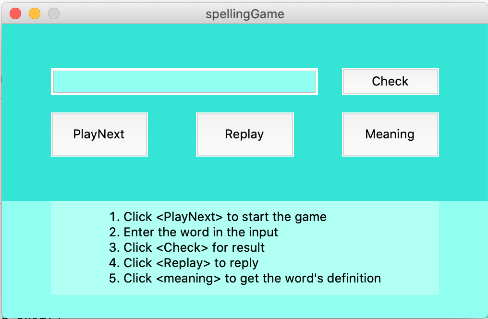

# SpellingGame
This game is intended to practice spelling. It is built on Python3 and is available to run with and without GUI.  



## Requirements
* gtts
* json
* pandas
* random
* difflib
* tkinter
* playsound

## To play though GUI
* Clone the repo
* `CD SpellingGame`
* `python3 GUI/gui.py`

## To play on Terminal
* Clone the repo
* `CD SpellingGame`
* `python3 Script/main.py`
```
Play: <1/0>: 1
Playing......
Listen again: <1/0>: 1
Playing......
Listen again: <1/0>: 0
Enter the word: palace
Correct Input :) 
Exit: <1/0>: 1
Playing......
Listen again: <1/0>: 0
Enter the word: transmitive
Incorrect Input :(  transmitted
Get Meaning: <1/0>: 1
transmitted :  ['To carry, particularly to a particular destination.', 'To send data over the airwaves, as in radio or television.', 'To spread or pass on something such as a disease or a signal.', 'To communicate news or information.', 'To convey energy or force through a mechanism.']
Exit: <1/0>: 0
```

---   
<details><summary>Want to contribute?</summary>
<p>

* Go through the open issues and read the description
* Please ask any doubt in the comment section of the issues before making assumptions
</p>
</details>